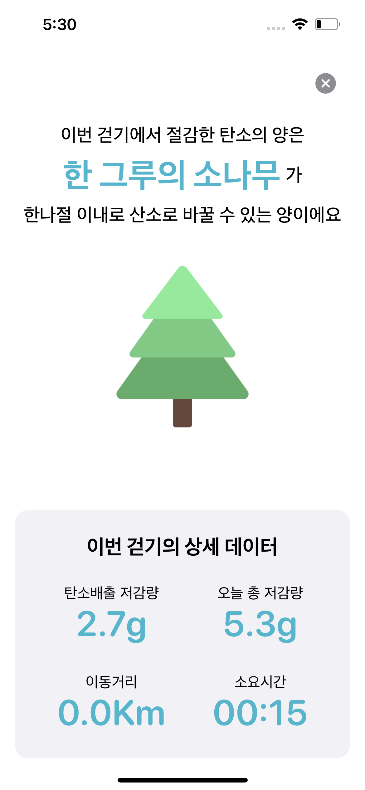

 

# 탄탄 : TanTan

**탄소 배출을 줄이기 위한 한걸음**

> 탄탄(TanTan)은 걸음으로써 탄소 배출을 얼마나 줄일 수 있는지 알려주는 어플리케이션 입니다.
>
> 탄탄은 여러분의 이동 거리를 측정합니다. 자동차를 타고 갈 때와 비교해 탄소 저감을 얼마나 시킬 수 있는지 체감해 보세요!
>
> 저감한 탄소 배출량을 확인하고, 탄소 배출을 줄여 빙하를 키워보세요

[TanTan APP Download Link](https://apps.apple.com/kr/app/%ED%83%84%ED%83%84-tantan/id1637676314)

 

### :book: Stack

1. 이슈관리 : Github, Notion
2. 형상관리 : Github
3. 커뮤니케이션 : Ryver, Notion, Zoom
4. 개발 환경
   - OS : MacOS (M1Pro)
   - IDE : Xcode 13.4.1
   - Database : Firestore
5. 상세 사용
   - Application : UIkit, SwiftUI
   - Design : Figma
   - Database : Firestore

 

### :rainbow: Usage

|                          **Splash**                          |                        **Onboarding**                        |                         **Measure**                          |
| :----------------------------------------------------------: | :----------------------------------------------------------: | :----------------------------------------------------------: |
|  |  |  |
|                          **Result**                          |                          **Chart**                           |                         **Iceberg**                          |
|  |  |  |

 

### :walking: Contact

[이재웅](https://github.com/JaewoongLee-swift) - duk0230@naver.com

[구본성](https://github.com/terry-koo) - xpflxhfl94@gmail.com

[오승연](https://github.com/ohhseungyeon) - acrosstheuniverse22@naver.com

[한경준](https://github.com/HanGyeongjun) - hgjun0212@icloud.com

[류현선](https://github.com/hs-ryu) - munam4@naver.com

